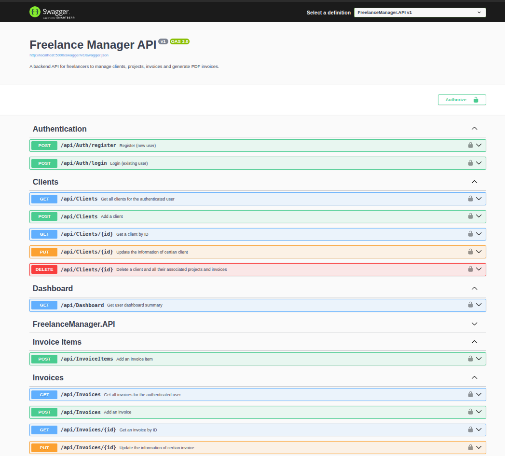

# Freelance Manager API

A fully-featured backend REST API for freelancers to manage clients, projects, time entries, and invoices — including **PDF invoice generation**. Built as a portfolio project to demonstrate real-world ASP.NET Core development practices.

---

## Tech Stack

| Layer | Technology |
|---|---|
| Framework | ASP.NET Core 8 Web API |
| Database | SQLite + Entity Framework Core 8 |
| Authentication | ASP.NET Core Identity + JWT |
| PDF Generation | QuestPDF |
| Documentation | Swagger / OpenAPI |
| Containerization | Docker + Docker Compose |

---

## Features

- **JWT Authentication** — register, login, and secure all endpoints with bearer tokens
- **Client Management** — full CRUD with search and status filtering
- **Project Management** — track hourly and fixed-price projects, filter by status and client
- **Time Entries** — log hours worked against projects with automatic total calculation
- **Invoice Management** — create invoices with line items, automatic subtotal/tax/total calculation, and overdue detection
- **PDF Invoice Generation** — generate professional PDF invoices via a single endpoint using QuestPDF
- **Dashboard** — summary endpoint with revenue stats and invoice counts
- **User Isolation** — every user only sees their own data, enforced at the database query level
- **Global Error Handling** — structured error responses via custom middleware
- **Pagination & Filtering** — all list endpoints support pagination, search, and filtering
- **Swagger UI** — fully documented and testable API with JWT support built in

---

## Getting Started

### Prerequisites
- [Docker](https://docs.docker.com/get-docker/) installed on your machine. That's it.

### Run with Docker

```bash
git clone https://github.com/Motasem-Ali-A/freelance-manager-api.git
cd freelance-manager-api
docker compose up --build
```

The API will be available at:
- **Swagger UI:** http://localhost:5000/swagger
- **Base URL:** http://localhost:5000/api

> The SQLite database is persisted in a local `data/` folder via Docker volume, so your data survives container restarts.

### Run without Docker

```bash
cd FreelanceManager.API
dotnet run
```

> Requires [.NET 8 SDK](https://dotnet.microsoft.com/download/dotnet/8.0)

---

## API Overview

### Auth
| Method | Endpoint | Description |
|--------|----------|-------------|
| POST | `/api/Auth/register` | Register a new user |
| POST | `/api/Auth/login` | Login and receive a JWT token |

### Clients
| Method | Endpoint | Description |
|--------|----------|-------------|
| GET | `/api/Clients` | Get all clients (supports search & status filter) |
| GET | `/api/Clients/{id}` | Get client by ID |
| POST | `/api/Clients` | Create a new client |
| PUT | `/api/Clients/{id}` | Update a client |
| DELETE | `/api/Clients/{id}` | Delete a client |

### Projects
| Method | Endpoint | Description |
|--------|----------|-------------|
| GET | `/api/Projects` | Get all projects (supports status & client filter) |
| GET | `/api/Projects/{id}` | Get project by ID |
| POST | `/api/Projects` | Create a new project |
| PUT | `/api/Projects/{id}` | Update a project |
| DELETE | `/api/Projects/{id}` | Delete a project |

### Time Entries
| Method | Endpoint | Description |
|--------|----------|-------------|
| GET | `/api/TimeEntries` | Get all time entries |
| GET | `/api/TimeEntries/{id}` | Get time entry by ID |
| POST | `/api/TimeEntries` | Log a time entry |
| PUT | `/api/TimeEntries/{id}` | Update a time entry |
| DELETE | `/api/TimeEntries/{id}` | Delete a time entry |

### Invoices
| Method | Endpoint | Description |
|--------|----------|-------------|
| GET | `/api/Invoices` | Get all invoices (supports status & date filter) |
| GET | `/api/Invoices/{id}` | Get invoice by ID |
| POST | `/api/Invoices` | Create an invoice |
| PUT | `/api/Invoices/{id}` | Update an invoice |
| DELETE | `/api/Invoices/{id}` | Delete an invoice |
| GET | `/api/Invoices/{id}/pdf` | Generate and download a PDF invoice |

### Dashboard
| Method | Endpoint | Description |
|--------|----------|-------------|
| GET | `/api/Dashboard` | Get revenue summary and invoice statistics |

### Invoice Items
| Method | Endpoint | Description |
|--------|----------|-------------|
| POST | `/api/InvoiceItems` | Add an invoice item |
---

## Project Structure

```
FreelanceManager/
├── FreelanceManager.API/         # Controllers, Middleware, Services, Program.cs
│   ├── Controllers/              # API endpoints
│   ├── Documents/                # QuestPDF invoice document definition
│   ├── Middleware/               # Global exception handling
│   └── Services/                 # TokenService, InvoiceService, ProjectService
│
├── FreelanceManager.Core/        # Domain layer — no dependencies on other projects
│   ├── DTOs/                     # Request and response data transfer objects
│   ├── Enums/                    # BillingType, InvoiceStatus, ProjectStatus
│   ├── Exceptions/               # Custom exception classes
│   ├── Interfaces/               # Repository and service contracts
│   └── Models/                   # Domain entities
│
└── FreelanceManager.Data/        # Data access layer
    ├── Repositories/             # EF Core repository implementations
    ├── Migrations/               # EF Core database migrations
    └── ApplicationDbContext.cs   # DbContext with Identity
```

---

## Authentication

All endpoints except `/api/auth/register` and `/api/auth/login` require a valid JWT token.

**To authenticate in Swagger UI:**
1. Call `POST /api/Auth/register` to create an account
2. Call `POST /api/Auth/login` to get your token
3. Click the **Authorize** button at the top of Swagger UI
4. Enter: `Bearer <your_token>`

**To authenticate via HTTP header:**
```
Authorization: Bearer <your_token>
```

---

## Architecture Highlights

- **Clean Architecture** — Core has zero dependencies on Data or API layers
- **Repository Pattern** — data access is abstracted behind interfaces, making the codebase testable and swappable
- **Service Layer** — business logic lives in dedicated service classes, not controllers
- **User Isolation** — `UserId` is stamped on every entity at creation and all queries filter by the authenticated user's ID
- **Global Exception Middleware** — unhandled exceptions are caught and returned as structured JSON responses instead of raw stack traces

---

## License

MIT
